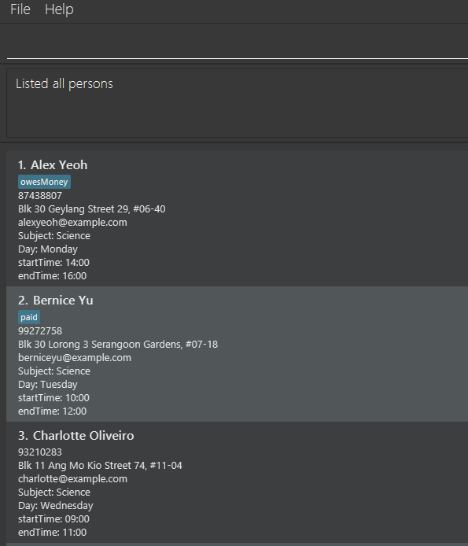

[](https://github.com/AY2526S1-CS2103T-T12-1/tp/actions/workflows/gradle.yml)

[](https://codecov.io/gh/AY2526S1-CS2103T-T12-1/tp)

# EduDex

EduDex is a desktop app for tutors to manage student contacts and classes,
optimized for freelance tutors who prefer using **Command Line Interface (CLI)**.

---

## UI Overview


<br>
*Figure 1: Main interface of EduDex*

---

## Quick start

1. Ensure you have Java `17` or above installed in your Computer.<br>
   **Mac users:** Ensure you have the precise JDK version prescribed [here](https://se-education.org/guides/tutorials/javaInstallationMac.html).

1. Download the latest `.jar` file from [here](https://github.com/AY2526S1-CS2103T-T12-1/tp/releases).

1. Copy the file to the folder you want to use as the _home folder_ for your EduDex.

1. Open a command terminal, `cd` into the folder you put the jar file in,
   and use the `java -jar edudex.jar` command to run the application.<br>
   Note that the app contains some sample data.<br>

1. Type the command in the command box and press Enter to execute it. e.g. typing **`help`** and pressing Enter will open the help window.<br>
   Some example commands you can try:

    * `list` : Lists all contacts.

    * `add n/John Doe p/98765432 e/johnd@example.com a/John street, Block 123, #01-01 d/Wednesday 
      start/15:00 end/16:00`: <br> 
      Adds a student named `John Doe` to EduDex.

    * `delete 3` : Deletes the 3rd student shown in the current list from EduDex.

    * `exit` : Exits the app.

1. Refer to the [Features](#features) below for details of each command.

---

## MVP Features
**Feature list**:
1. [Add student](#add-student)
2. [Delete student](#delete-student)
3. [View all student contacts](#view-all-student-contacts)
4. [Find student by name or day](#find-student-by-name-or-day)
5. [Exit program](#exit-program)


**Notes about the command format:**

* Words in `UPPER_CASE` are the parameters to be supplied by the user.<br>
  e.g. in `add n/NAME`, `NAME` is a parameter which can be used as `add n/John Doe`.

* Parameters can be in any order.<br>
  e.g. if the command specifies `n/NAME p/PHONE_NUMBER`, `p/PHONE_NUMBER n/NAME` is also acceptable.

* Extraneous parameters for commands that do not take parameters (such as `list` and `exit`) will be ignored.<br>
  e.g. if the command specifies `exit 123`, it will be interpreted as `exit`.

* If you are using a PDF version of this document, be careful when copying and pasting commands that span
  multiple lines as space characters surrounding line-breaks may be omitted when copied over to the application.

<br>

### Add student
Adds a student’s contact to the address book <br>

Format: `add n/NAME p/PHONE_NUMBER e/EMAIL a/ADDRESS d/DAY start/TIME_START end/TIME_END`

Example:
`add n/John Doe p/98765432 e/johnd@example.com a/John street, Block 123, #01-01 d/Wednesday start/1500 end/1600`

**Parameters**:
- NAME:
  - Acceptable values: any string will be accepted, input will not be modified or cleaned 
  - Error message: no error message, all inputs are accepted

- PHONE_NUMBER:
  - Acceptable values: digits from 0-9, any length
  - Error message: “Phone number must contain only numbers!”

- EMAIL:
  - Acceptable values: any string will be accepted
  - Error message: no error message

- ADDRESS:
  - Acceptable values: any string will be accepted
  - Error message: no error message

- DAY:
  - Acceptable values: { Monday, Tuesday, Wednesday, Thursday, Friday, Saturday, Sunday }
  - Error message: “For DAY field, please input a day of the week”

- TIME_START:
  - Acceptable values: a 4 digit integer (can be prefixed with 0s) whereby the first 2 digits are from 00 to 23 (inclusive); and the last 2 digits are from 00 to 59 (inclusive)
  - Error message: “Enter the start time as: HH:MM”

- TIME_END:
  - Acceptable values: a 4 digit integer (can be prefixed with 0s) whereby the first 2 digits are from 00 to 23 (inclusive); and the last 2 digits are from 00 to 59 (inclusive)
  - Error message: “Enter the end time as: HH:MM”

**Outputs**:
- Succeed: 
```
New student added: 
<NAME>; Phone: <NUMBER>; Email: <EMAIL>; Address: <ADDRESS>; Subject: Science; Day: <DAY>; TIME: <TIME_START> - <TIME_END>
```
- Fail:
```
Invalid command format!
add: Adds a student to the address book.
Format: `add n/NAME p/PHONE_NUMBER e/EMAIL a/ADDRESS d/DAY start/TIME_START end/TIME_END`
Example: add n/John Doe p/98765432 e/johnd@example.com a/John street, Block 123, #01-01 d/Wednesday
start/15:00 end/16:00
```

<br>

### Delete student
Delete a student's contact from the address book. <br>

Format: `delete INDEX`

Example Commands:
- `delete 1`
- `delete 23`

**Parameter**:
- INDEX
  - Acceptable values: positive integers that have a valid student contact
  - Error messages:
    1. If INDEX is not an integer <br>
       e.g.: `delete chicken` <br>
       Output: `INDEX must be a positive integer.`
    2. If INDEX is a negative number <br>
       e.g.: `delete -2` <br>
       Output: `INDEX must be a positive integer.`
    3. If INDEX does not exist in the list <br>
       e.g.: `delete 10000000` <br>
       Output: `The contact index provided is invalid.`

**Outputs**:
- Succeed: `Student contact <NAME> is successfully removed from EduDex.`
- Fail: No change in EduDex

<br>

### View all student contacts
Displays all student contacts in a numbered list, starting from index 1.

Format: `list`

The command `list` takes in no parameters.

**Outputs**:
- Succeed: Shows a list of all the contacts in the format

Output example: <br>
`Here are all your contacts.`<br>



<br>

### Find student by name or day
Finds all student contacts whose names or day contain any of the given keywords. <br>
Format: `find <NAME1> <NAME2>...` or `find d/<DAY>`

Example Commands:
- `find alice bob charlie`
- `find d/Monday`

**Parameters**:
- NAME:
  - Acceptable values: any string will be accepted, input will not be modified or cleaned
  - Error message: no error message, all inputs are accepted
  - Matching is case-insensitive.
- DAY:
  - Acceptable values: { Monday, Tuesday, Wednesday, Thursday, Friday, Saturday, Sunday }
  - Error message: “Invalid Command Format. Days should only be one of the following: Monday, Tuesday, Wednesday, Thursday, Friday, Saturday, Sunday”

**Outputs**:
- Succeed: Shows a list of all the contacts that match the search criteria in the format
- Output example: <br>
`5 persons listed!`
- Fail: `0 persons listed!` if no matching contacts found.

### Exit program
Exits and closes the EduDex app.

Format: `exit`

The command `exit` takes in no parameters.

Outputs:
- Succeed: Goodbye message is shown and the system stops. \
  `Exiting EduDex... Bye!`
- Fail: no Goodbye message is shown and application will still be running.

<br>

---
## FAQs


1. **How do I install Java 17 on my computer?** <br>
Refer to the [official Oracle download page](https://www.oracle.com/java/technologies/javase/jdk17-archive-downloads.html)
or follow the [installation guide for your OS](https://se-education.org/guides/tutorials/javaInstallation.html).
Mac users should install the exact JDK version specified [here](https://se-education.org/guides/tutorials/javaInstallationMac.html).


2. **Why is EduDex not launching when I run `java -jar edudex.jar`?** <br>
Ensure that:
   1. You have installed Java 17.
   2. You are in the correct directory containing the `.jar` file.
   3. You typed the command correctly: `java -jar edudex.jar`.


3. **Can I import my existing student data from another program?** <br>
Currently, EduDex only supports data stored in its own save file format. Future versions may include data import/export features.


4. **Where is my data saved?** <br>
All data is saved automatically in a file located in the same folder as the EduDex `.jar` file. <br>
If you move or delete this file, EduDex will start with a fresh, empty address book.


5. **What happens if I type a wrong command?** <br>
EduDex will display an error message and provide guidance on the correct command format. No data will be changed.


6. **Does EduDex work offline?** <br>
Yes, EduDex is a fully offline application. No internet connection is required once you have downloaded the `.jar` file.


7. **Will EduDex work on Linux/Windows/Mac platforms?** <br>
Yes. EduDex is platform-independent as long as Java 17 is installed.
